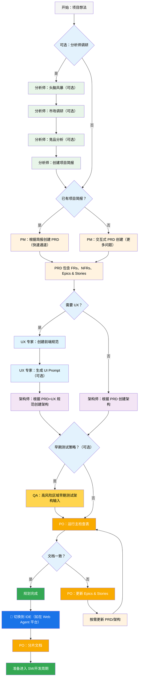

# BMad Method — 用户指南

本指南将帮助你理解并高效使用 BMad Method 进行敏捷、AI驱动的规划与开发。

## BMad 计划与执行工作流

首先，这是完整的标准绿地（Greenfield）规划 + 执行工作流。棕地（Brownfield）流程非常类似，但建议先理解绿地流程，即使是在一个简单项目上，也要先体验绿地流程再处理棕地项目。BMad Method 需要安装在新项目文件夹的根目录。规划阶段可选用强大的 Web Agent，通常能以更低成本获得更高质量的结果（如在部分 Agentic 工具中提供自己的 API Key 或积分）。规划时，强大的思维模型和更大的上下文——以及与 Agent 合作——将获得最佳效果。

如果你要在棕地项目（已有项目）中使用 BMad Method，请查阅 **[在棕地项目中工作](./working-in-the-brownfield.md)**。

如果下方流程图无法渲染，请在 VSCode（或其分支克隆版）安装 Markdown All in One 和 Markdown Preview Mermaid Support 插件。安装后，右键标签页可选择“Open Preview”，或查阅 IDE 文档。

### 规划工作流（Web UI 或强大 IDE Agent）

在开发开始前，BMad 遵循结构化的规划流程，建议在 Web UI 中完成以节省成本：



#### Web UI 到 IDE 的转变

**关键转折点**：PO 确认文档一致后，必须从 Web UI 切换到 IDE，开始开发流程：

1. **复制文档到项目**：确保 `docs/prd.md` 和 `docs/architecture.md` 在项目的 docs 文件夹（或安装时指定的自定义位置）
2. **切换到 IDE**：在你喜欢的 Agentic IDE 中打开项目
3. **文档分片**：使用 PO agent 分片 PRD 和架构文档
4. **开始开发**：进入核心开发周期

#### 规划产物（标准路径）

```text
PRD              → docs/prd.md
架构             → docs/architecture.md
分片 Epics       → docs/epics/
分片 Stories     → docs/stories/
QA 评估          → docs/qa/assessments/
QA Gate          → docs/qa/gates/
```

### 核心开发周期（IDE）

规划完成且文档分片后，BMad 遵循结构化开发流程：

```mermaid
graph TD
    A["开发阶段开始"] --> B["SM：回顾上一个 Story 的开发/QA 记录"]
    B --> B2["SM：根据分片 Epic+架构草拟下一个 Story"]
    B2 --> S{"高风险 Story？（可选）"}
    S -->|是| T["QA：*risk + *design Story 草稿"]
    S -->|否| B3
    T --> U["创建测试策略与风险档案"]
    U --> B3{"PO：验证 Story 草稿（可选）"}
    B3 -->|请求验证| B4["PO：根据产物验证 Story"]
    B3 -->|跳过验证| C{"用户批准"}
    B4 --> C
    C -->|批准| D["Dev：顺序执行任务"]
    C -->|需修改| B2
    D --> E["Dev：实现任务与测试"]
    E --> V{"开发中 QA 检查？（可选）"}
    V -->|是| W["QA：*trace 或 *nfr 早期验证"]
    V -->|否| F
    W --> X["Dev：补齐覆盖/NFR 缺口"]
    X --> F["Dev：运行所有验证"]
    F --> G["Dev：标记为待评审并添加备注"]
    G --> H{"用户验证"}
    H -->|请求 QA 评审| I["QA：测试架构师评审 + 质量 Gate"]
    H -->|直接批准| M["重要：确保所有回归测试和 Lint 通过"]
    I --> J["QA：测试架构分析 + 主动重构"]
    J --> L{"QA 决策"}
    L -->|需开发修复| D
    L -->|批准| M
    H -->|需修复| D
    M --> N["重要：提交更改后再继续！"]
    N --> Y{"需更新 Gate？"}
    Y -->|是| Z["QA：*gate 更新状态"]
    Y -->|否| K
    Z --> K["标记 Story 完成"]
    K --> B

    style A fill:#f5f5f5,color:#000
    style B fill:#e8f5e9,color:#000
    style B2 fill:#e8f5e9,color:#000
    style S fill:#e3f2fd,color:#000
    style T fill:#ffd54f,color:#000
    style U fill:#ffd54f,color:#000
    style B3 fill:#e3f2fd,color:#000
    style B4 fill:#fce4ec,color:#000
    style C fill:#e3f2fd,color:#000
    style D fill:#e3f2fd,color:#000
    style E fill:#e3f2fd,color:#000
    style V fill:#e3f2fd,color:#000
    style W fill:#ffd54f,color:#000
    style X fill:#e3f2fd,color:#000
    style F fill:#e3f2fd,color:#000
    style G fill:#e3f2fd,color:#000
    style H fill:#e3f2fd,color:#000
    style I fill:#f9ab00,color:#fff
    style J fill:#ffd54f,color:#000
    style K fill:#34a853,color:#fff
    style L fill:#e3f2fd,color:#000
    style M fill:#ff5722,color:#fff
    style N fill:#d32f2f,color:#fff
    style Y fill:#e3f2fd,color:#000
    style Z fill:#ffd54f,color:#000
```



## 前置条件

安装 BMad Method 前，请确保：

- **Node.js** ≥ 18，**npm** ≥ 9
- 已安装并配置 **Git**
- **（可选）** VS Code 安装 "Markdown All in One" + "Markdown Preview Mermaid Support" 扩展

## 安装

### 可选

如需在 Web 上用 Claude（Sonnet 4 或 Opus）、Gemini Gem（2.5 Pro）或自定义 GPT 进行规划：

1. 进入 `dist/teams/`
2. 复制 `team-fullstack.txt`
3. 创建新的 Gemini Gem 或 CustomGPT
4. 上传文件并附言：“你的关键操作指令已附，请严格按指令执行”
5. 输入 `/help` 查看可用命令

### IDE 项目设置

```bash
# 交互式安装（推荐）
npx bmad-method install
```

### OpenCode

BMAD 通过项目级 `opencode.jsonc`/`opencode.json`（仅 JSON，无 Markdown 备选）集成 OpenCode。

- 安装方式：
  - 运行 `npx bmad-method install`，在 IDE 列表中选择 `OpenCode`
  - 安装器会检测现有 `opencode.jsonc`/`opencode.json`，如无则创建最简 `opencode.jsonc`
  - 它会：
    - 确保 `instructions` 包含 `.bmad-core/core-config.yaml`（及所选扩展包的 `config.yaml`）
    - 以文件引用（`{file:./.bmad-core/...}`）方式合并 BMAD agent 和命令，幂等处理
    - 保留其他顶层字段和用户自定义内容

- 前缀与冲突：
  - 可选择 agent key 加 `bmad-` 前缀，命令 key 加 `bmad:tasks:` 前缀，避免命名冲突
  - 如 key 已存在且非 BMAD 管理，安装器会跳过并建议启用前缀

- 添加内容：
  - `instructions`：`.bmad-core/core-config.yaml` 及所选扩展包 `config.yaml`
  - `agent`：核心及所选包的 BMAD agent
    - `prompt`：`{file:./.bmad-core/agents/<id>.md}`（或包路径）
    - `mode`：主控 agent 用 `primary`，其他用 `all`
    - `tools`：`{ write: true, edit: true, bash: true }`
    - `description`：从 agent 的 whenToUse 提取
  - `command`：核心及所选包的 BMAD 任务
    - `template`：`{file:./.bmad-core/tasks/<id>.md}`（或包路径）
    - `description`：从任务 Purpose 部分提取

- 仅选中包：
  - 仅包含你在前一步选择的核心和扩展包的 agent 和任务

- 变更后刷新：
  - 重新运行：
    ```bash
    npx bmad-method install -f -i opencode
    ```
  - 安装器安全更新，无重复，保留你的自定义字段和注释

- 可选便捷脚本：
  - 可在项目 `package.json` 添加脚本，快速刷新：
    ```json
    {
      "scripts": {
        "bmad:opencode": "bmad-method install -f -i opencode"
      }
    }
    ```

### Codex（CLI & Web）

BMAD 通过 `AGENTS.md` 和已提交的核心 agent 文件集成 OpenAI Codex。

- 两种安装模式：
  - Codex（仅本地）：`.bmad-core/` 忽略，仅本地开发
    - `npx bmad-method install -f -i codex -d .`
  - Codex Web 启用：`.bmad-core/` 需跟踪，可提交到 Codex Web
    - `npx bmad-method install -f -i codex-web -d .`

- 生成内容：
  - 项目根目录生成 `AGENTS.md`，BMAD 区块包含：
    - Codex（CLI & Web）使用说明
    - agent 目录（标题、ID、使用场景）
    - 每个 agent 详细介绍（源码路径、使用场景、激活短语、YAML）
    - 任务及快速使用说明
  - 如有 `package.json`，自动添加便捷脚本：
    - `bmad:refresh`、`bmad:list`、`bmad:validate`

- 使用 Codex：
  - CLI：在项目根运行 `codex`，自然提问，如“作为开发，实现……”
  - Web：提交 `.bmad-core/` 和 `AGENTS.md`，在 Codex 打开仓库同样提问

- 变更后刷新：
  - 重新运行对应安装模式（`codex` 或 `codex-web`），更新 `AGENTS.md` 的 BMAD 区块

## 特殊 Agent

BMAD 有两个 agent——未来将合并为单一 BMad-Master。

### BMad-Master

此 agent 可执行所有其他 agent 的任务和命令，除实际 story 实现外。它还能在 Web 上访问知识库，向你解释 BMad Method 的任何流程。

如果你不想在 dev 之外切换 agent，这就是你的首选。但随着上下文增长，agent 性能会下降，因此需定期指示 agent 压缩对话并以压缩后的内容开启新会话。建议每实现一个 story 后都这样做。

### BMad-Orchestrator

此 agent 不应在 IDE 内使用，是重量级、特殊用途 agent，使用大量上下文，可变形为其他 agent。仅用于 Web bundle 团队协作。使用 Web bundle 时会由 BMad Orchestrator 接待。

### Agent 工作原理

#### 依赖系统

每个 agent 有 YAML 依赖定义：

```yaml
dependencies:
  templates:
    - prd-template.md
    - user-story-template.md
  tasks:
    - create-doc.md
    - shard-doc.md
  data:
    - bmad-kb.md
```

**要点：**

- agent 只加载所需资源（精简上下文）
- 依赖在打包时自动解析
- 资源在 agent 间共享，保持一致性

#### Agent 交互

**在 IDE：**

```bash
# 部分 IDE（如 Cursor、Windsurf）用 @ 符号手动规则
@pm 创建任务管理应用的 PRD
@architect 设计系统架构
@dev 实现用户认证

# 部分 IDE（如 Claude Code）用斜杠命令
/pm 创建用户故事
/dev 修复登录 bug
```

#### 交互模式

- **增量模式**：逐步，用户参与
- **YOLO 模式**：快速生成，最少交互

## IDE 集成

### IDE 最佳实践

- **上下文管理**：只保留相关文件，文件尽量精简聚焦
- **Agent 选择**：按任务选用合适 agent
- **迭代开发**：小步快跑，聚焦任务
- **文件组织**：保持项目结构清晰
- **定期提交**：频繁保存工作

## 测试架构师（QA Agent）

### 概述

BMad 的 QA agent 不只是“高级开发者评审”——而是**测试架构师**，精通测试策略、质量 Gate 和风险测试。名为 Quinn，既有质量建议权，也能在安全情况下主动优化代码。

#### 快速开始（核心命令）

```bash
@qa *risk {story}       # 开发前风险评估
@qa *design {story}     # 创建测试策略
@qa *trace {story}      # 开发中验证测试覆盖
@qa *nfr {story}        # 检查质量属性
@qa *review {story}     # 全面评审 → 写 Gate
```

#### 命令别名（测试架构师）

文档用简写，长短都可：

```text
*risk    → *risk-profile
*design  → *test-design
*nfr     → *nfr-assess
*trace   → *trace-requirements（或 *trace）
*review  → *review
*gate    → *gate
```

### 核心能力

#### 1. 风险评估（`*risk`）

**时机：** Story 草稿后，开发前（最早介入点）

识别并评估实现风险：

- **类别**：技术、安全、性能、数据、业务、运维
- **评分**：概率 × 影响（1-9 分）
- **缓解**：针对每项风险给出策略
- **Gate 影响**：风险 ≥9 触发 FAIL，≥6 触发 CONCERNS（详见 `tasks/risk-profile.md`）

#### 2. 测试设计（`*design`）

**时机：** Story 草稿后，开发前（指导测试编写）

制定全面测试策略，包括：

- 每个验收标准的测试场景
- 推荐合适测试级别（单元、集成、E2E）
- 基于风险优先级（P0/P1/P2）
- 测试数据需求与 mock 策略
- CI/CD 执行策略

**示例输出：**

```yaml
test_summary:
  total: 24
  by_level:
    unit: 15
    integration: 7
    e2e: 2
  by_priority:
    P0: 8 # 必须有——关键风险
    P1: 10 # 应有——中等风险
    P2: 6 # 可选——低风险
```

#### 3. 需求追踪（`*trace`）

**时机：** 开发中（中途检查点）

映射需求与测试覆盖：

- 记录每个验收标准对应的测试
- 用 Given-When-Then 表达（文档用，不是 BDD 代码）
- 标记覆盖缺口及严重等级
- 创建可审计的追踪矩阵

#### 4. NFR 评估（`*nfr`）

**时机：** 开发中或早期评审（验证质量属性）

验证非功能需求：

- **核心四项**：安全、性能、可靠性、可维护性
- **证据驱动**：查找实际实现证明
- **Gate 集成**：NFR 不达标直接影响质量 Gate

#### 5. 全面测试架构评审（`*review`）

**时机：** 开发完成，Story 标记“待评审”

运行 `@qa *review {story}` 时，Quinn 执行：

- **需求追踪**：每个验收标准对应测试
- **测试级别分析**：确保单元、集成、E2E 测试合理
- **覆盖评估**：发现缺口与冗余
- **主动重构**：安全时直接优化代码
- **质量 Gate 决策**：按结果发出 PASS/CONCERNS/FAIL

#### 6. 质量 Gate（`*gate`）

**时机：** 评审修复后或需更新 Gate 状态时

管理质量 Gate 决策：

- **确定性规则**：PASS/CONCERNS/FAIL 明确标准
- **并行权威**：QA 管理 `docs/qa/gates/` gate 文件
- **建议性质**：提供建议，不阻塞流程
- **豁免支持**：需记录原因、批准人、到期日（见 `templates/qa-gate-tmpl.yaml`、`tasks/review-story.md`、`tasks/risk-profile.md`）

### 与测试架构师协作

#### 集成 BMad 工作流

测试架构师贯穿开发全周期，各能力使用时机如下：

| **阶段**          | **命令** | **使用时机**         | **价值**                  | **输出**                                                     |
| ------------------ | ----------- | ----------------------- | -------------------------- | -------------------------------------------------------------- |
| **Story 草拟** | `*risk`     | SM 草拟 Story 后   | 早识别风险    | `docs/qa/assessments/{epic}.{story}-risk-{YYYYMMDD}.md`        |
|                    | `*design`   | 风险评估后   | 指导测试策略 | `docs/qa/assessments/{epic}.{story}-test-design-{YYYYMMDD}.md` |
| **开发阶段**    | `*trace`    | 开发中      | 验证测试覆盖       | `docs/qa/assessments/{epic}.{story}-trace-{YYYYMMDD}.md`       |
|                    | `*nfr`      | 功能开发时 | 早发现质量问题 | `docs/qa/assessments/{epic}.{story}-nfr-{YYYYMMDD}.md`         |
| **评审阶段**         | `*review`   | 开发完成   | 全面质量评估    | Story QA 结果 + gate 文件                                |
| **评审后**    | `*gate`     | 修复后     | 更新质量决策    | 更新 `docs/qa/gates/{epic}.{story}-{slug}.yml`              |

#### 示例命令

```bash
# 规划阶段 - 开发前运行
@qa *risk {draft-story}     # 有哪些风险？
@qa *design {draft-story}   # 应写哪些测试？

# 开发阶段 - 编码时运行
@qa *trace {story}          # 测试覆盖全了吗？
@qa *nfr {story}            # 质量标准达标吗？

# 评审阶段 - 开发完成后运行
@qa *review {story}         # 全面评审 + 重构

# 评审后 - 修复后运行
@qa *gate {story}           # 更新 Gate 状态
```

### 强制质量标准

Quinn 强制以下测试质量原则：

- **无不稳定测试**：异步处理可靠
- **无硬等待**：仅用动态等待
- **无状态、并行安全**：测试独立运行
- **自清理**：测试自管测试数据
- **测试级别合理**：逻辑用单元，交互用集成，流程用 E2E
- **显式断言**：断言只在测试，不在辅助函数

### Gate 状态含义

- **PASS**：所有关键需求达标，无阻塞问题
- **CONCERNS**：发现非关键问题，团队需关注
- **FAIL**：关键问题需修复（如安全风险、缺 P0 测试）
- **WAIVED**：问题已被团队接受，需注明原因、批准人、到期

### 特殊情况

**高风险 Story：**

- 开发前务必运行 `*risk` 和 `*design`
- 开发中可加 `*trace` 和 `*nfr` 检查

**复杂集成：**

- 开发中用 `*trace` 检查所有集成点测试
- 后续用 `*nfr` 验证集成性能

**性能关键：**

- 开发早期和过程中多次运行 `*nfr`
- 不要等到评审才发现性能问题

**棕地/遗留代码：**

- 先用 `*risk` 识别回归风险
- 用 `*review` 重点关注兼容性

### 最佳实践

- **早期介入**：Story 草拟时就运行 `*design` 和 `*risk`
- **风险驱动**：用风险分数决定测试优先级
- **迭代改进**：用 QA 反馈优化后续 Story
- **Gate 透明**：团队共享 Gate 决策
- **持续学习**：QA 文档沉淀团队知识
- **棕地关注**：遗留系统重点防回归风险

### 输出路径参考

测试架构师输出存储路径速查：

```text
*risk-profile  → docs/qa/assessments/{epic}.{story}-risk-{YYYYMMDD}.md
*test-design   → docs/qa/assessments/{epic}.{story}-test-design-{YYYYMMDD}.md
*trace         → docs/qa/assessments/{epic}.{story}-trace-{YYYYMMDD}.md
*nfr-assess    → docs/qa/assessments/{epic}.{story}-nfr-{YYYYMMDD}.md
*review        → Story QA 结果 + gate 文件引用
*gate          → docs/qa/gates/{epic}.{story}-{slug}.yml
```

## 技术偏好系统

BMad 通过 `.bmad-core/data/technical-preferences.md` 文件实现个性化，可引导 PM 和架构师推荐你的设计模式、技术选型等偏好。

### 用于 Web Bundle

创建自定义 Web Bundle 或上传到 AI 平台时，包含你的 `technical-preferences.md`，确保 agent 从会话开始就了解你的偏好。

## 核心配置

`.bmad-core/core-config.yaml` 是关键配置文件，支持不同项目结构，未来将有更多选项。目前最重要的是 yaml 中 devLoadAlwaysFiles 列表。

### 开发者上下文文件

定义 dev agent 始终加载的文件：

```yaml
devLoadAlwaysFiles:
  - docs/architecture/coding-standards.md
  - docs/architecture/tech-stack.md
  - docs/architecture/project-structure.md
```

分片架构后需确认这些文档存在、精简，并只包含 dev agent 始终需遵循的规则。

项目成长后，编码规范应只保留 agent 仍需强制的部分。agent 会参考文件周边代码，推断当前任务相关规范。

## 获取帮助

- **Discord 社区**：[加入 Discord](https://discord.gg/gk8jAdXWmj)
- **GitHub Issues**：[报告 Bug](https://github.com/bmadcode/bmad-method/issues)
- **文档**：[浏览文档](https://github.com/bmadcode/bmad-method/docs)
- **YouTube**：[BMadCode 频道](https://www.youtube.com/@BMadCode)

## 结语

记住：BMad 旨在提升你的开发流程，而非取代你的专业。把它当作加速项目的强力工具，同时保持对设计和实现的主导权。
